本文仅对一些常见的优化方法进行直观介绍和简单的比较，主要是一阶的梯度法，包括 `SGD`, `Momentum`, `Nesterov Momentum, AdaGrad`, `RMSProp`, `Adam`。 其中 `SGD`, `Momentum` ,`Nesterov Momentum` 是手动指定学习速率的，而后面的 `AdaGrad`, `RMSProp`, `Adam` 就能够自动调节学习速率。

## 1. SGD

SGD 全名 Stochastic Gradient Descent， 即**随机梯度下降**。不过这里的 SGD 其实跟 MBGD (Minibatch Gradient Descent) 是一个意思，即随机抽取一批样本，以此为根据来更新参数。

### 具体实现

#### 需要

学习速率 `ϵ`, 初始参数 `θ` 

#### 每步迭代过程

1) 从训练集中的随机抽取一批容量为 `m` 的样本 `{x1,…,xm}`以及相关的输出 `yi`；

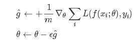

2) 计算梯度和误差并更新参数。

### 优点

1. 训练速度快，对于很大的数据集，也能够以较快的速度收敛。SGD 应用于凸问题时，`k` 次迭代后泛化误差的数量级是 `O(1/sqrt(k))`，强凸下是 `O(1/k)`。
2. **可能由于 SGD 在学习中增加了噪声，有正则化的效果**

### 缺点：

由于是抽取，因此不可避免得到的梯度肯定有误差。因此**学习速率需要逐渐减小，否则模型无法收敛** ，因为误差，所以每一次迭代的梯度受抽样的影响比较大，也就是说**梯度含有比较大的噪声，不能很好的反映真实梯度**。

### 应用

`ϵ` 学习率如何衰减以保证 SGD 收敛，在实践中，一般是进行线性衰减: 

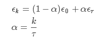

其中 `ϵ0` 是初始学习率， `ϵτ` 是最后一次迭代的学习率。 `τ` 自然代表迭代次数。

一般来说，`ϵτ` 设为 `ϵ0` 的 `1%` 比较合。.而 `τ` 一般设为让训练集中的每个数据都输入模型**上百次**比较合适。那么初始学习率 `ϵ0` 怎么设置呢？书上说，你先用固定的学习速率迭代 100 次，找出效果最好的学习速率，然后 `ϵ0` 设为比它大一点就可以了。

## 2. Momentum

SGD 方法的一个缺点是，其更新方向完全依赖于当前的 batch，因而其更新十分不稳定，每次迭代计算的梯度含有比较大的噪音。解决这一问题的一个简单的做法便是引入 momentum。

**momentum 即动量，它模拟的是物体运动时的惯性，即更新的时候在一定程度上保留之前更新的方向，同时利用当前batch的梯度微调最终的更新方向。这样一来，可以在一定程度上增加稳定性，从而学习地更快，并且还有一定摆脱局部最优的能力。**

### 具体实现

#### 需要

学习速率 `ϵ`，初始参数 `θ`，初始速率`v`，动量衰减参数 `α`

#### 每步迭代过程

1) 从训练集中的随机抽取一批容量为 `m` 的样本 `{x1,…,xm}`，以及相关的输出 `yi`；
2) 计算梯度和误差，并更新速度 `v` 和参数 `θ`。

 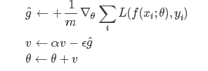

其中：参数 `α` 表示每回合速率 `v` 的衰减程度。如果每次迭代得到的梯度都是 `g` ，那么最后得到的 `v` 的稳定值为：

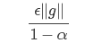

也就是说，Momentum 最好情况下能够将学习速率加速 `1/(1−α)` 倍。一般 `α` 的取值有 `0.5，``0.9`，`0.99` 这几种，分别表示最大速度 `2` 倍，`10` 倍，`100` 倍于 SGD 的算法。当然，也可以让 `α` 的值随着时间而变化，一开始小点，后来再加大。不过这样一来，又会引进新的参数。

### 特点

- 前后梯度方向一致时，能够加速学习；
- 前后梯度方向不一致时，能够抑制震荡；

## 3. Nesterov Momentum

这是对传统 Momentum 方法的一项改进，由 L	lya Sutskever (2012 unpublished) 在 Nesterov 工作的启发下提出的。

### 具体实现：

#### 需要

学习速率 `ϵ`，初始参数 `θ`，初始速率 `v`，动量衰减参数 `α` 

#### 每步迭代过程

1) 从训练集中的随机抽取一批容量为 `m` 的样本 `{x1,…,xm}`，以及相关的输出 `yi`

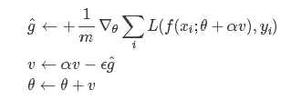

2) 计算梯度和误差，并更新速度 `v` 和参数 `θ`: 
3) 注意在估算梯度 `g` 的时候，参数变成了 `θ+αv` 而不是之前的 `θ`，与 Momentum 唯一区别就是，计算梯度的不同，Nesterov 先用当前的速度 `v` 更新一遍参数，在用更新的临时参数计算梯度。

其基本思路如下图 (转自 Hinton的coursera 公开课 Lecture 6a)： 

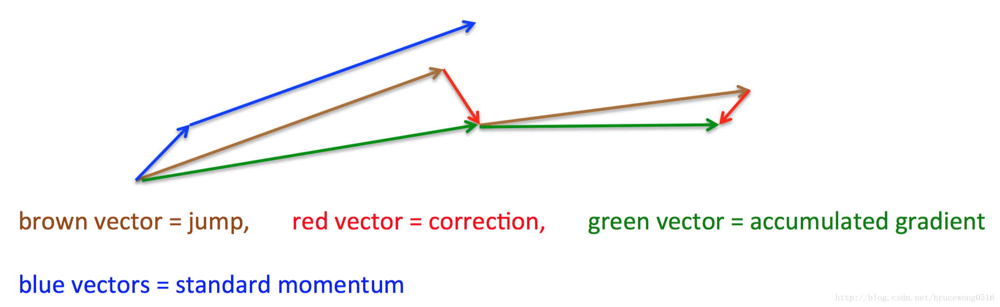

## 4. AdaGrad

AdaGrad可以自动变更学习速率，只是需要设定一个全局的学习速率 `ϵ`，但是这并非是实际学习速率，实际的速率是与以往参数的模之和的开方成反比的。也许说起来有点绕口，不过用公式来表示就直白的多：

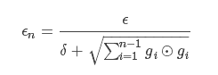

其中 `δ` 是一个很小的常量，大概在 `10^−7`，防止出现除以 `0` 的情况。

### 具体实现

#### 需要

全局学习速率 `ϵ`, 初始参数 `θ`, 数值稳定量 `δ`

#### 中间变量

梯度累计量 `r` (初始化为 `0`)

#### 每步迭代过程

1) 从训练集中的随机抽取一批容量为 `m` 的样本 `{x1,…,xm}`，以及相关的输出 `yi`；
2) 计算梯度和误差，更新 `r`，再根据 `r` 和梯度计算参数更新量

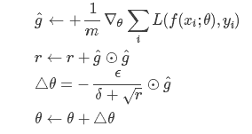

### 优点

能够实现学习率的自动更改。如果这次梯度大，那么学习速率衰减的就快一些；如果这次梯度小，那么学习速率衰减的慢一些。对于每个参数，随着其更新的总距离增多，其学习速率也随之变慢。

### 缺点

任然要设置一个变量 `ϵ` ,经验表明，在普通算法中也许效果不错，但在深度学习中，深度过深时会造成训练提前结束。

## 5. RMSProp

RMSProp 通过引入一个衰减系数，让 `r` 每回合都衰减一定比例，类似于 Momentum 中的做法，是对 AdaGrad 算法的改进。

### 具体实现

#### 需要

全局学习速率 `ϵ`, 初始参数 `θ`, 数值稳定量 `δ`，衰减速率 `ρ`

#### 中间变量

梯度累计量 `r` (初始化为 `0`)

#### 每步迭代过程

1) 从训练集中的随机抽取一批容量为 `m` 的样本 `{x1,…,xm}`,以及相关的输出 `yi`；
2) 计算梯度和误差,更新r,再根据r和梯度计算参数更新量 

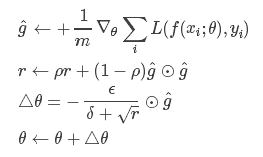

### 优点
- 相比于 AdaGrad，这种方法很好的解决了深度学习中过早结束的问题； 
- 适合处理非平稳目标，对于 RNN 效果很好

### 缺点
- 又引入了新的超参，衰减系数 `ρ`
- 依然依赖于全局学习速率

## 6. RMSProp with Nesterov Momentum

此方法是将 RMSProp 和 Nesterov Momentum 结合起来

### 具体实现

#### 需要
全局学习速率 `ϵ`, 初始参数 `θ`, 初始速率 `v`，动量衰减系数 `α`, 梯度累计量衰减速率 `ρ` 

#### 中间变量

梯度累计量 `r` (初始化为 `0`)

#### 每步迭代过程

1) 从训练集中的随机抽取一批容量为 `m` 的样本 `{x1,…,xm}`,以及相关的输出 `yi`
2) 计算梯度和误差,更新 `r`，再根据 `r` 和梯度计算参数更新量 

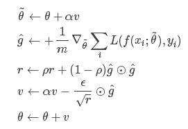

## 7. Adam

Adam (Adaptive Moment Estimation) 本质上是带有动量项的 RMSprop，它利用梯度的一阶矩估计和二阶矩估计动态调整每个参数的学习率。Adam 的优点主要在于经过偏置校正后，每一次迭代学习率都有个确定范围，使得参数比较平稳。

### 具体实现

#### 需要
步进值 `ϵ`, 初始参数 `θ`，数值稳定量 `δ`，一阶动量衰减系数 `ρ1`，二阶动量衰减系数 `ρ2`

其中几个取值一般为：`δ = 10^−8, ρ1=0.9, ρ2=0.999`

#### 中间变量

一阶动量 `s`，二阶动量 `r`，都初始化为 0

#### 每步迭代过程

1) 从训练集中的随机抽取一批容量为 `m` 的样本 `{x1,…,xm}`，以及相关的输出 `yi`
2) 计算梯度和误差，更新 `r` 和 `s`，再根据 `r` 和 `s` 以及梯度计算参数更新量

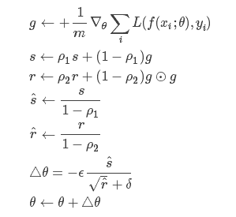

## 8. 各个方法的比较

Karpathy 做了一个这几个方法在 MNIST 上性能的比较，其结论是：

AdaGrad 相比于 SGD 和 Momentum 更加稳定，即不需要怎么调参。而精调的 SGD 和 Momentum 系列方法无论是收敛速度还是精度都比 AdaGrad 要好一些。在精调参数下，一般 Nesterov Momentum 优于 SGD。而 AdaGrad 一方面不用怎么调参，另一方面其性能稳定优于其他方法。

Loss vs. Number of examples seen 

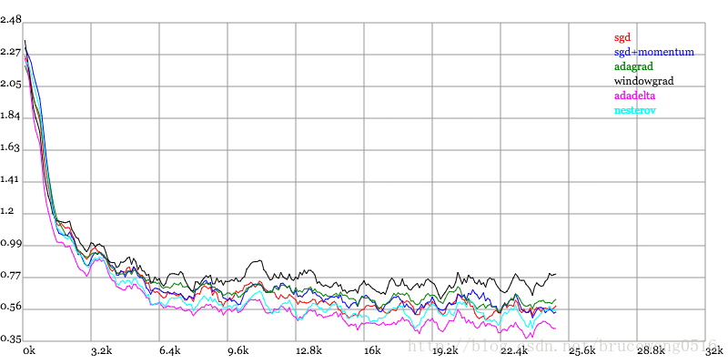

Testing Accuracy vs. Number of examples seen 

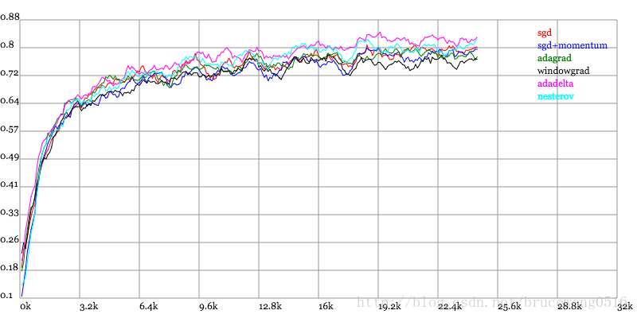
